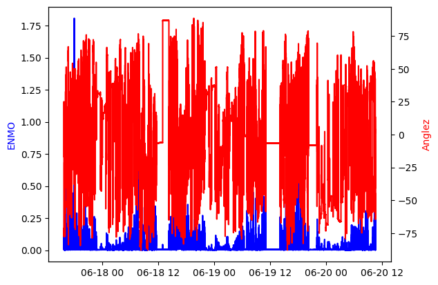
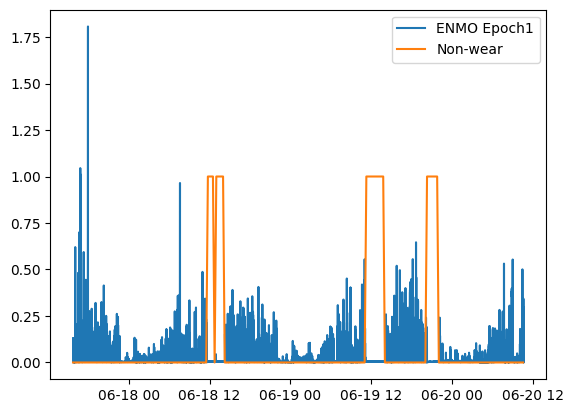

# Wristpy Tutorial


## Introduction


Wristpy is a Python library designed for processing and analyzing wrist-worn accelerometer data.
This tutorial will guide you through the basic steps of using `wristpy` to analyze your accelerometer data. Specifically,
we will cover the following topics through a few examples:
   - running the default processor, analyzing the output data, and visualizing the results.
   - loading data and plotting the raw signals.
   - how to calibrate the data, computing ENMO and angle-z from the calibrated data and then plotting those metrics.
   - how to obtain non-wear windows and visualize them.
   - how to obtain sleep windows and visualize them.


## Example 1: Running the default processor


The `orchestrator` module of wristpy contains the default processor that will run the entire wristpy processing pipeline. This can be called as simply as:

```python
from wristpy.core import orchestrator

results = orchestrator.run(
   input = '/path/to/your/file.gt3x',
   output = 'path/to/save/file_name.csv'
)
```
This runs the processing pipeline with all the default arguments, creates an output `.csv` file, a `.json` file with the pipeline configuration parameters, and will create a `results` object that contains the various output metrics (namely; the specified physical activity metric, angle-z, physical activity classification values, non-wear status, and sleep status).


The orchestrator can also process entire directories. The call to the orchestrator remains largely the same but now output is expected to be a directory and the desired filetype for the saved files **must** be specified:

```python
from wristpy.core import orchestrator

results = orchestrator.run(
    input = '/path/to/input/dir',
    output = '/path/to/output/dir',
    output_filetype = ".csv"
)
```


We can visualize some of the outputs within the `results` object, directly, with the following scripts:

Plot the default physical activity metrics (ENMO) across the entire data set:
```python
from matplotlib import pyplot as plt
plt.plot(results.physical_activity_metric.time, results.physical_activity_metric.measurements)
```


Plot the sleep windows with normalized angle-z data:
```python
from matplotlib import pyplot as plt

plt.plot(results.anglez.time, results.anglez.measurements/90)
plt.plot(results.sleep_status.time, results.sleep_status.measurements)
plt.legend(['Angle Z', 'Sleep Windows'])
plt.show()
```


We can also view and process these outputs from the saved `.csv` output file:

```python
import polars as pl
import matplotlib.pyplot as plt

output_results = pl.read_csv('path/to/save/file_name.csv', try_parse_dates=True)

activity_mapping = {
    "inactive": 0,
    "light": 1,
    "moderate": 2,
    "vigorous": 3
}

phys_activity = output_results['physical_activity_levels'].replace(activity_mapping).cast(int)

plt.plot(output_results['time'], phys_activity)
```


It is also possible to do some analysis on these output variables, for example, if we want to find the percent of time spent inactive, or in light, moderate, or vigorous physical activity:

```python
inactivity_count = sum(phys_activity == 0)
light_activity_count = sum(phys_activity == 1)
moderate_activity_count = sum(phys_activity == 2)
vigorous_activity_count = sum(phys_activity == 3)
total_activity_count = len(output_results['physical_activity_levels'])

print(f'Light activity percent: {light_activity_count*100/total_activity_count}')
print(f'Moderate activity percent: {moderate_activity_count*100/total_activity_count}')
print(f'Vigorous activity percent: {vigorous_activity_count*100/total_activity_count}')
print(f'Inactivity percent: {inactivity_count*100/total_activity_count}')
```

```
Light activity percent: 11.678738267689539
Moderate activity percent: 1.0778725410363006
Vigorous activity percent: 0.030000428577551107
Inactivity percent: 87.21338876269661
```

> ### Configuring a custom pipeline
>
> A custom processing pipeline can be easily created by modifying the input arguments to the `orchestrator.run` call.
>
>> For example:
>> ```python
>> results = orchestrator.run(input = '/path/to/input/dir', output = '/path/to/output/dir', output_filetype = ".parquet", calibrator="gradient", activity_metric="ag_count", nonwear_algorithm=["detach"], epoch_length=10, thresholds=[0.05, 0.1, 0.3])
>> ```
> Complete documentation on these parameters can be found [here](https://childmindresearch.github.io/wristpy/wristpy/core/orchestrator.html#run).


## Example 2: Loading data and plotting the raw signals


In this example we will go over the built-in functions to directly read the raw accelerometer and light data, and how to quickly visualize this information.

The built-in `readers` module can be used to load all the sensor and metadata from one of the support wristwatches (`.gt3x` or `.bin`), the reader will automatically select the appropriate loading methodology.

```python
from wristpy.io.readers import readers

watch_data = readers.read_watch_data('/path/to/geneactive/file.bin')
```

We can then visualize the raw accelerometer and light sensor values very easily as follows:

Plot the raw acceleration along the *x*-axis:

`plt.plot(watch_data.acceleration.time, watch_data.acceleration.measurements[:,0])`


Plot the light data:

`plt.plot(watch_data.lux.time, watch_data.lux.measurements)`


## Example 3:  Plot the epoch-level measurements

In this example we will expand on the skills learned in `Example 2`: we will load the sensor data, calibrate, and then calculate the ENMO and angle-z data in 5s windows (epoch-level data).

```python
from wristpy.io.readers import readers
from wristpy.processing import calibration, metrics
from wristpy.core import computations

watch_data = readers.read_watch_data('/path/to/geneactive/file.bin')

#Calibration phase
calibrator_object = calibration.ConstrainedMinimizationCalibration()
calibrated_data = calibrator_object.run_calibration(watch_data.acceleration)

#Compute the desired metrics
enmo = metrics.euclidean_norm_minus_one(calibrated_data)
anglez = metrics.angle_relative_to_horizontal(calibrated_data)

#Obtain the epoch-level data, default is 5s windows
enmo_epoch1 = computations.moving_mean(enmo)
anglez_epoch1 = computations.moving_mean(anglez)
```

We can then visualize the `epoch1` measurements as:
```python

fig, ax1 = plt.subplots()


ax1.plot(enmo_epoch1.time, enmo_epoch1.measurements, color='blue')
ax1.set_ylabel('ENMO', color='blue')

ax2 = ax1.twinx()
ax2.plot(anglez_epoch1.time, anglez_epoch1.measurements, color='red')
ax2.set_ylabel('Anglez', color='red')

plt.show()
```



## Example 4: Visualize the detected non-wear times

In this example we will build on `Example 3` by also solving for the non-wear periods, as follows:

```python
from wristpy.io.readers import readers
from wristpy.processing import calibration, metrics


watch_data = readers.read_watch_data('/path/to/geneactive/file.bin')
calibrator_object = calibration.ConstrainedMinimizationCalibration()
calibrated_data = calibrator_object.run_calibration(watch_data.acceleration)

#Find non-wear periods, using the DETACH algorithm
non_wear_array = metrics.detect_nonwear(calibrated_data)

```

We can then visualize the non-wear periods, in comparison to movement (ENMO at the epoch-level):
```python
from wristpy.core import computations

enmo = metrics.euclidean_norm_minus_one(calibrated_data)
enmo_epoch1 = computations.moving_mean(enmo)


plt.plot(enmo_epoch1.time, enmo_epoch1.measurements)
plt.plot(non_wear_array.time, non_wear_array.measurements)

plt.legend(['ENMO Epoch1', 'Non-wear'])
```



## Example 5: Compute and plot the sleep windows


We can visualize the sleep periods in comparison to other metrics; in this example, we compare the sleep windows to the angle-z data and the non-wear periods. In the default pipeline any sleep periods that overlap with non-wear periods are filtered out.
This plot shows the sleep periods visualized by a blue trace, non-wear periods are visualized with a green trace, and the angle-z data with the semi-transparent red trace. These are all accessible directly from the results object created with the custom pipeline:

```python
import matplotlib.pyplot as plt

fig, ax1 = plt.subplots()

ax1.plot(results.sleep_status.time, results.sleep_status.measurements, color='blue', label='Sleep Periods')
plt.plot(results.nonwear_status.time, results.nonwear_status.measurements, color='green')
ax2 = ax1.twinx()
ax2.plot(results.anglez.time, results.anglez.measurements, color='red', alpha=0.5)
ax2.set_ylabel('Anglez Epoch1', color='red')

ax1.set_ylabel('Sleep Period/Non-wear')
ax1.set_ylim(0, 1.5)

plt.show()
```

