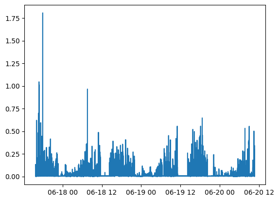
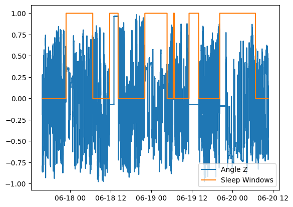

Wristpy Tutorial
================

Introduction
------------

Wristpy is a Python library designed for processing and analyzing wrist-worn accelerometer data. 
This tutorial will guide you through the basic steps of using Wristpy to analyze your accelerometer data. Specifically,
we will cover the following topics through a few examples:
   - running the default processor, analyzing the output data, and visualizing the results
   - loading data and plotting the raw signals
   - how to calibrate the data, the different options, computing ENMO and angle-z from the calibrated data and then plotting those metrics
   - how to obtain non-wear windows and visualize them
   - how to obtain sleep windows and visualize them
      - how we can filter sleep windows that overlap with non-wear


Example 1: Running the default processor
----------------------------------------

The `orchestrator` module of wristpy contains the default processor that will run the entire wristpy processing pipeline. This can be called as simply as:

```python
from wristpy.core import orchestrator

results = orchestrator.run(
   input = '/path/to/your/file.gt3x',
   output = 'path/to/save/file_name.csv'
)
```
This runs the processing pipeline with all the default arguments, creates an output `.csv` file, and will create a `results` object that contains the various output metrics (namely, enmo, angle-z, physical activity values, non-wear detection, sleep detection).

We can visualize some of the outputs within the `results` object, directly, with the following scripts:

Plot the ENMO across the entire data set:
```python
from matplotlib import pyplot as plt
plt.plot(results.enmo.time, results.enmo.measurements)
```



Plot the sleep windows with normalized angle-z data:
```python
from matplotlib import pyplot as plt
plt.plot(results.anglez.time, results.anglez.measurements/90)
plt.plot(results.sleep_windows_epoch.time, results.sleep_windows_epoch.measurements)
plt.legend(['Angle Z', 'Sleep Windows'])
plt.show()
```


We can also view and process these outputs from the saved `.csv` output file:

```python
import polars as pl
import matplotlib.pyplot as plt
output_results = pl.read_csv('output_three_nights.csv', try_parse_dates=True)


plt.plot(output_results['time'], output_results['physical_activity_levels'])
```


It is also possible to do some analysis on these output variables, for example, if we ant to find the percent of time spent inactive, or in light, moderate, or vigorous physical activity:

```python
inactivity_count = sum(output_results['physical_activity_levels'] == 0)
light_activity_count = sum(output_results['physical_activity_levels'] == 1)
moderate_activity_count = sum(output_results['physical_activity_levels'] == 2)
vigorous_activity_count = sum(output_results['physical_activity_levels'] == 3)
total_activity_count = len(output_results['physical_activity_levels'])

print(f'Light activity percent: {light_activity_count*100/total_activity_count}')
print(f'Moderate activity percent: {moderate_activity_count*100/total_activity_count}')
print(f'Vigorous activity percent: {vigorous_activity_count*100/total_activity_count}')
print(f'Inactivity percent: {inactivity_count*100/total_activity_count}')
```

```
Light activity percent: 12.394840157038699
Moderate activity percent: 1.1030099083940923
Vigorous activity percent: 0.031158471988533682
Inactivity percent: 86.47099146257868
```


Example 2: Loading data and plotting the raw signals
----------------------------------------------------

In this example we will go over the built-in functions to directly read the raw accelerometer and light data, and how to quickly visualize this information.

The built in `readers` module can be used to load all the sensor and metadata from one of the support wrist-watches (`.gt3x` or `.bin`), the reader will automatically select the appropirate loading methodology. 

```python
from wristpy.io.readers import readers

watch_data = readers.read_watch_data('/path/to/geneactive/file.bin')
```

We can then visualize the raw accelerometer and light sensor values very easily as follows:

Plot the raw acceleration along the *x*-axis:

`plt.plot(watch_data.acceleration.time, watch_data.acceleration.measurements[0:1])`


Plot the light data:

`plt.plot(watch_data.lux.time, watch_data.lux.measurements)`


Example 3: 
----------------------------------------------------
- load data
- calibrate data
-compute metrics
plot enmo and anglez

Example 4:
----------------------------------------------------
 - get nonwear, plot vs enmo

Example 5:
----------------------------------------------------
 - get sleep, plot vs anglez
 - plot sleep, nonwear, and anglez
 - filter nonwear from sleep, plot filtered sleep vs anglez vs nonwear